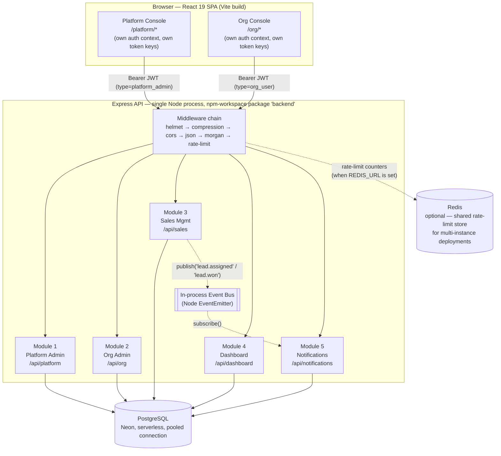
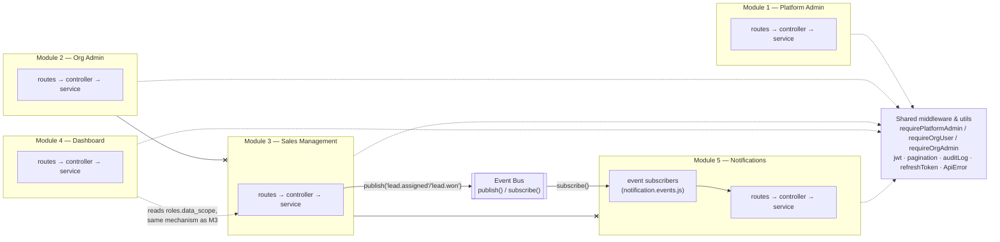
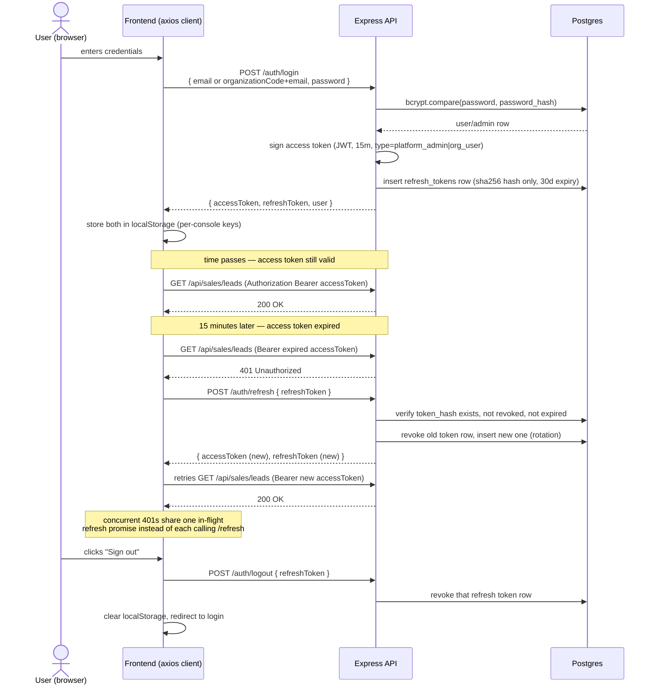
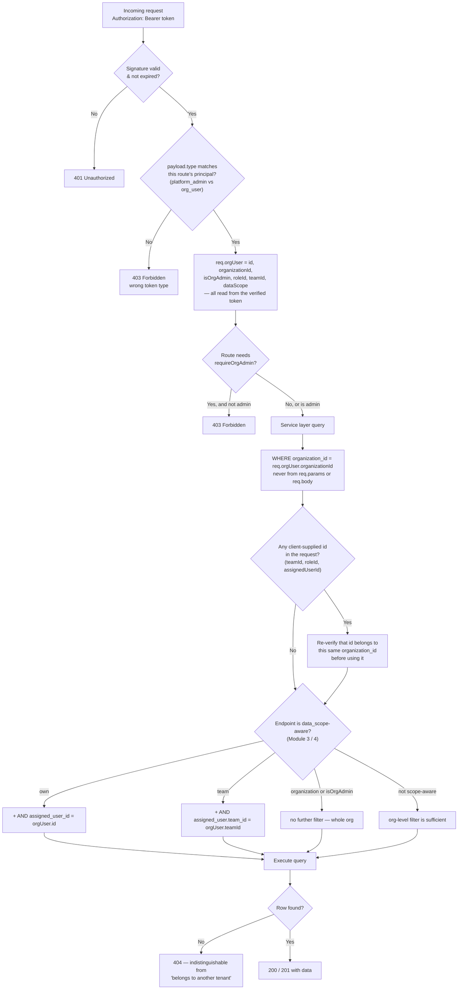
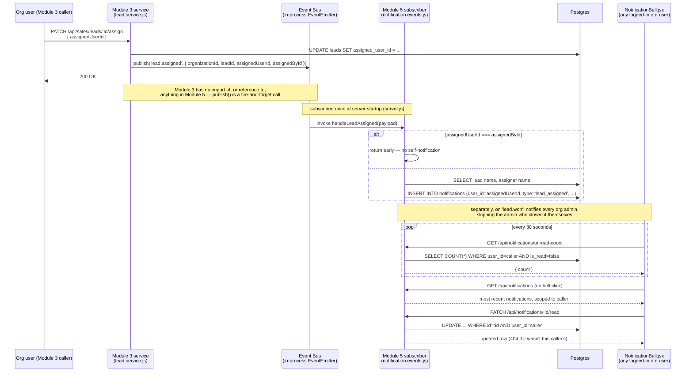

# HiLite Sales OS — Architecture Document

This document describes how the system is put together: the components
and how they talk to each other, where one module's responsibility ends
and another's begins, how authentication and authorization actually work
request-by-request, how one codebase serves many tenants safely, how
notifications get from a sales action to a user's screen without Sales
ever knowing Notifications exists, and what's genuinely solved versus
genuinely deferred on the scaling front.

Companion documents: **`API.md`** (every endpoint), **`DATABASE.md`**
(every table, every index, the ER diagrams). This document is the layer
above both — the *why* behind the shapes those two describe in detail.

## Contents

1. [System overview](#1-system-overview)
2. [Module boundaries](#2-module-boundaries)
3. [Authentication strategy](#3-authentication-strategy)
4. [Authorization strategy](#4-authorization-strategy)
5. [Multi-tenant design](#5-multi-tenant-design)
6. [Notification design](#6-notification-design)
7. [Scaling considerations](#7-scaling-considerations)

---

## 1. System overview

A monolith on both sides of the wire, deliberately: one Express process
serving five modules, one React SPA serving two consoles — not because
five services and two apps wouldn't be a reasonable design at a different
scale, but because at this scale a monolith means one deploy, one set of
logs, and no network hop between modules that are going to be called
together constantly anyway (Module 4's dashboard reads the same `leads`
table Module 3 writes, in the same request, by calling SQL directly — not
over HTTP to "the sales service"). §7 covers what changes if that
calculus stops holding.



**Why two consoles, one app shell each, but one repo**: a platform admin
and an org user are different principals with different concerns (manage
tenants vs. manage one tenant's own data) and different JWTs that must
never be interchangeable (§3) — splitting them into `features/platform`
and `features/org`, each with its own auth context, API client, token
storage keys, and layout shell, makes that boundary a directory structure
instead of just a convention. They share only generic UI primitives
(`components/ui/`) and the `createApiClient` factory.

**Why Postgres over Neon specifically**: serverless, connection-pooled
(PgBouncer) out of the box — which matters once more than one API
instance is running and each is holding its own `pg.Pool` (§7) — and
requires no infrastructure to provision for local dev beyond an
environment variable.

**Why an in-process event bus instead of a message queue from day one**:
because the loose coupling the assessment asks for (Sales shouldn't
directly create notifications) is an *interface* property, not an
infrastructure property — `publish()`/`subscribe()` is the same shape
whether the implementation behind it is a Node `EventEmitter` or
BullMQ+Redis. Building the interface right now and deferring the
infrastructure decision until there's an actual second instance to
coordinate across is cheaper than guessing at queue configuration nobody
can load-test yet. §6 covers exactly where this stops being sufficient.

---

## 2. Module boundaries

Five modules, each a `routes → controller → service` stack mounted at
its own prefix, each module's directory self-contained under
`backend/src/modules/<name>/`. The boundary that matters most isn't the
URL prefix, though — it's which modules know about which others at the
*code* level:



The two `--x` (blocked) edges are the point of this diagram, not an
afterthought: **Module 2 has no code dependency on Module 3** (org/team/
role/user management works whether or not Sales Management is even
installed for that org), and **Module 3 has no code dependency on
Module 5** — grep the Sales module's source and `notifications` doesn't
appear anywhere in it. The only thing connecting them is the event bus,
and that connection is one-directional: Module 5 imports `eventBus.js`
to subscribe; Module 3 imports it to publish; neither imports the other.

Module 4 is the one genuine exception to "modules don't know about each
other" — its queries read directly from `leads` and `activities`
(Module 3's tables) and apply the same `data_scope` concept Module 3 uses
for lead visibility. That's a deliberate choice, not an oversight: a
dashboard *is* a different view over Sales' data, not an independent
domain with its own data to own, so duplicating the permission model
elsewhere would just be two implementations of the same rule to keep in
sync. What it does *not* do is import Module 3's service functions
directly — it runs its own SQL against the same tables, which keeps
Module 3 free to change its internal service-layer shape without Module 4
breaking.

Within a module, `routes.js` only wires HTTP verbs to controller
functions; `controller.js` only translates `req`/`res` into and out of
plain JS calls (no SQL, no business rules); `service.js` is where every
actual decision lives — scope checks, validation calls, transactions. A
controller function is never more than: validate → call one service
function → wrap the result in the response envelope.

---

## 3. Authentication strategy

Two principal types, each with their own login endpoint, their own JWT
`type` claim, and their own frontend token storage — never interchangeable:

| | Platform admin | Org user |
|---|---|---|
| Identified by | email + password | organization code + email + password |
| JWT `type` claim | `platform_admin` | `org_user` |
| Used for | Managing tenants (Module 1) | Everything inside one tenant (Modules 2–5) |

**Why a short-lived JWT plus a separate revocable refresh token, instead
of one long-lived JWT or a server-side session:** a stateless JWT can't
be revoked once issued — that's inherent to the format, not a gap in this
implementation. Making it short-lived (15 minutes, `ACCESS_TOKEN_EXPIRES_IN`)
bounds how long a stolen one matters. Sessions that need to last longer
than that are carried by a second token — a random value, hashed with
sha256 before it's stored, looked up against `refresh_tokens` on every
use — which genuinely can be revoked, because that lookup happens against
the database, not a signature check. Logout, deactivating a user, or
suspending an organization (§5) all revoke immediately through this path
without waiting for an access token to expire on its own.



**Rotation**: every `/refresh` call revokes the token it was given and
issues a new one (`replaced_by_id` links the two rows), so a refresh
token is single-use in practice even though nothing forces that at the
network layer — reusing an already-rotated one is rejected outright,
which is a detectable signal of token theft even though nothing currently
*acts* on that signal beyond rejecting the reuse.

**What's inside an org user's access token** — `sub`, `organizationId`,
`isOrgAdmin`, `roleId`, `teamId`, `dataScope`, `type: 'org_user'`. Every
one of those is read fresh from the database on the *next* refresh, not
pushed to already-issued tokens — so a role/team reassignment, or an
admin-initiated password reset (which also revokes the affected refresh
token), takes effect within one access-token lifetime (≤15 minutes) at
the outside, not instantly. That's a real, bounded latency window worth
knowing about rather than assuming away.

**Forced password change**: every system-generated temp password (org
creation, user creation, an admin-initiated reset) sets
`must_change_password = true` on the user row; the login/refresh response
surfaces it, and the frontend gates on it. This is enforced client-side
only — a still-valid access token issued before the flag was set keeps
working against the API regardless of the flag, since nothing in the
middleware chain checks it.

**Passwords** are hashed with bcrypt before storage, full stop — never
compared or stored in plaintext anywhere, including in audit logs (which
record the *action* "password changed," never the password itself).

---

## 4. Authorization strategy

Two layers, stacked, each answering a different question:

1. **Which principal is this, and are they even allowed to call this
   route at all?** — `requireOrgUser` / `requireOrgAdmin` /
   `requirePlatformAdmin` middleware, applied per-route or per-router.
2. **Of the data this principal's organization owns, how much of it can
   *this specific* request see?** — the `data_scope` mechanism, applied
   inside the service layer for Modules 3 and 4 only.

These two layers, plus the tenant-isolation check from §5, all happen in
one pass over a request:



**Why `requireOrgAdmin` is a separate middleware stacked on top of
`requireOrgUser`, instead of one combined check**: Modules 3, 4, and 5
need "any logged-in org user" without the admin requirement — a regular
Executive needs to create leads and see their own dashboard, not just
org admins. Module 2 (team/role/user management) needs the admin
requirement on top. Keeping them separate middleware means Module 3+
reuses the first without inheriting the second.

**Why `data_scope` lives on the role, not hardcoded by role name**: the
assessment's three-tier model (Executive: own leads, Team Lead: team
data, Director: org-wide) only works as *permissions* if it's decoupled
from what a role happens to be *called* — roles are an admin-editable
table (Module 2 lets admins rename or invent roles), so basing access on
`role.name === 'Director'` would silently break the moment someone
renamed it, or silently grant org-wide access to a newly invented role
that was never meant to have it. `roles.data_scope` is the actual
permission; the name is just a label. The exact filtering logic (in
`lead.service.js`) is three lines:

```js
function scopeCondition(orgUser, paramsRef) {
  if (orgUser.isOrgAdmin || orgUser.dataScope === 'organization') return '1=1';
  if (orgUser.dataScope === 'team') {
    if (!orgUser.teamId) return '1=0'; // team-scoped but not on a team -> sees nothing, not everything
    paramsRef.push(orgUser.teamId);
    return `au.team_id = $${paramsRef.length}`;
  }
  paramsRef.push(orgUser.id);
  return `l.assigned_user_id = $${paramsRef.length}`;
}
```

Note the `team`-scope-but-no-team case resolves to "sees nothing," not
"falls through to seeing everything" — a misconfigured account fails
closed.

**Defense in depth, not defense by obscurity**: the frontend also hides
nav items and redirects non-admins away from admin-only pages
(`AdminProtectedRoute`). That's explicitly a UX courtesy documented as
such in the code — the real enforcement is server-side, and every
backend integration test for this system asserts against the API
directly, never against what the UI happens to render.

---

## 5. Multi-tenant design

Shared database, shared schema, one discriminator column:
`organization_id`, present on every tenant-owned table (8 of the 13
domain tables carry it directly; `lead_status_history` inherits it
transitively through `leads`). No database-per-tenant or
schema-per-tenant split — see `DATABASE.md` §2.1 for the column-by-column
detail. What belongs here is *why* this is safe and how tenancy actually
gets established on a request.

**Tenant resolution happens once, at login, not on every request.**
There's no subdomain routing — an org user's email is only unique
*within* their organization, not globally, so the login form asks for an
explicit organization code (the same pattern Slack/Notion-style workspace
logins use) to resolve which tenant's `users` row to check the password
against. Once resolved, `organizationId` is signed into the access token
(§3) — every subsequent request carries its own tenant context
cryptographically, with no repeated lookup and no way for a client to
assert a different one without invalidating the signature.

**Isolation is enforced at the query layer, not the schema layer** — see
the flow in §4. The one rule that actually matters: `organization_id` in
a `WHERE` clause always comes from `req.orgUser.organizationId` (off the
verified JWT), never from `req.params.id` or anything in the request
body. A request for another tenant's team, lead, or user by id returns a
plain `404`, not a `403` — the query simply finds no matching row, which
doesn't even confirm the id is valid in *some* other organization.

**The harder half is client-supplied ids that aren't the primary
resource** — assigning a user to a team, or a role, passes an id that
needs checking independently. `assertBelongsToOrg(table, id,
organizationId)` (Module 2) and `assertCanAssignTo` (Module 3) exist
specifically for this: before a `teamId`/`roleId`/`assignedUserId` from
the request body is used to *link* two rows together, it's re-verified
as belonging to the caller's own organization. Without this step, Org A
could guess or scrape an id from Org B and use it to cross-link tenants
even while every primary-resource lookup stays correctly scoped — this
was verified directly with an integration test: passing another org's
team id into an assignment is rejected, not silently accepted.

**Two tenant-level operational guarantees**: suspending an organization
(`PATCH /api/platform/organizations/:id/status`) revokes every refresh
token belonging to every user in that org in one query — not just future
logins, active sessions die too. And a new module added to the catalog
(§3 of `API.md`) requires no backfill for existing organizations — every
per-org module read already defaults a missing enablement row to
`enabled: false` via a `LEFT JOIN` + `COALESCE`, so "off by default until
explicitly granted" falls out of the read path rather than needing a
migration step every time the catalog grows.

**What this design does not do**: there's no per-tenant resource quota,
rate limit, or noisy-neighbor isolation — one organization running an
expensive query competes for the same connection pool and the same
Postgres instance as every other. At this scale that's an acceptable
trade for the operational simplicity of one schema; see §7 for when that
calculus would need revisiting.

---

## 6. Notification design

The requirement this satisfies — "the Sales module should not directly
create notifications" — is implemented as an actual absence of a code
path, not a comment promising one. `lead.service.js` has no import of,
and no reference to, anything under `modules/notifications/`.



**Two events, two rules for who gets notified** — not a generic
"broadcast to everyone who might care" model:

| Event | Published when | Notifies | Skipped when |
|---|---|---|---|
| `lead.assigned` | A lead is created or reassigned | The newly assigned user | They assigned it to themselves |
| `lead.won` | A lead's status is set to `won` | Every org admin | The admin being notified is the one who closed it |

`lead.won`'s "notify every admin" rule deliberately mirrors Module 4's
`organization`-scope concept (leadership-level visibility) rather than
inventing a separate notion of "who should know about this" — same
underlying idea (org-wide visibility for admins), applied to a different
kind of event instead of a different permission system.

**Delivery is polling, not push.** `NotificationBell.jsx` checks
`/unread-count` every 30 seconds for every logged-in org user, and fetches
the actual list only when the bell is clicked. This is a real,
deliberate trade-off: it's zero additional infrastructure (no
WebSocket/SSE connection management, no reconnection logic), and at
today's scale a 30-second-stale unread count is a non-issue. It does mean
request volume scales linearly with concurrent logged-in users regardless
of whether anything happened — the first thing to replace with
Socket.io/SSE if that polling volume ever actually shows up as load.

**Read-state is checked against the owning user, not just the row's
existence** — `PATCH /notifications/:id/read` filters on `id AND user_id
= caller`, so one user guessing another's notification id gets a plain
404, the same "doesn't exist for you" pattern as everywhere else in the
tenant-isolation story (§5).

**The scaling boundary, stated plainly**: the event bus is a Node
`EventEmitter` living in one process's memory. An event published on
instance A is invisible to a subscriber running on instance B — fine for
exactly the single-instance deployment this system runs as today, not
fine the moment a second API instance exists behind a load balancer. The
fix is swapping `eventBus.js`'s internals for a real broker (BullMQ+Redis,
RabbitMQ) — and because every caller only ever uses `publish()` and
`subscribe()`, that swap touches one file, not Module 3 or Module 5's
actual code.

---

## 7. Scaling considerations

What's actually built versus what's deliberately deferred, stated
separately rather than blended together.

### 7.1 Built and verified

| Concern | What's in place |
|---|---|
| **Stateless auth** | Access tokens carry every claim a request needs (§3) — no session-store lookup on the hot path, which is the actual precondition for running more than one API instance behind a load balancer at all |
| **Bounded response sizes** | Every list endpoint that can grow without bound paginates, with a server-enforced cap (`MAX_PAGE_SIZE=100`) a client can't override by asking |
| **Connection pool discipline** | `DB_POOL_MAX` is per-process and configurable (total connections to Postgres scale as instances × this, so it needs tuning down as instance count goes up); `DB_STATEMENT_TIMEOUT_MS` stops one slow query from holding a connection indefinitely; pool-pressure (requests waiting) is logged in development |
| **Indexes matched to real queries** | Every composite index mirrors an actual service-layer `WHERE` clause — see `DATABASE.md` §4 — not a blanket "index every foreign key" |
| **Multi-instance-aware rate limiting** | Redis-backed when `REDIS_URL` is set, so the limit is a true global count instead of N× the intended allowance across N instances — verified against a real Redis instance, not assumed from the library's docs |
| **N+1 avoidance** | Module 4's leaderboards join `leads`/`activities` once per leaderboard with `COUNT(DISTINCT ...)`, not once per user |
| **Tenant-data growth has no shared-resource ceiling baked in** | One organization's data volume doesn't structurally affect another's query performance beyond ordinary index/pool contention — there's no per-tenant table or partition, so this is a property of consistent indexing, not tenant isolation |

### 7.2 Deferred — and why that's a reasonable line to draw here

| Concern | Current state | What changes it |
|---|---|---|
| **Event bus** | In-process `EventEmitter` (§6) | Swap to BullMQ+Redis/RabbitMQ once a second API instance exists — `publish()`/`subscribe()` interface doesn't change |
| **Notification delivery** | 30-second polling | Socket.io/SSE once polling volume is measurably a problem, not before |
| **No caching layer** | Dashboard aggregates (Module 4) re-run their SQL on every request | A cache-aside layer over `/api/dashboard/summary` is the highest-value next addition if that endpoint's load ever matters — it's read-heavy and tolerant of a few seconds of staleness |
| **Unbounded table growth** | `refresh_tokens` (rotated/revoked rows accumulate) and `audit_logs` both have an index specifically positioned for a future purge job (`idx_refresh_tokens_expires_at`, `idx_audit_logs_created_at`) | No such job exists yet — this is prepared for, not solved |
| **No per-tenant resource isolation** | Every organization shares the same connection pool and Postgres instance | Acceptable trade for schema simplicity at this scale; would need revisiting (e.g. read replicas, or sharding by `organization_id`) only if one tenant's load could meaningfully degrade another's |

The throughline across both halves of this section: every "not yet"
above has a stated, specific trigger for when it stops being acceptable
— not vague "this might not scale" hand-waving, and not a claim that
everything here is already infinitely scalable. Both would be dishonest;
this is meant to be neither.
