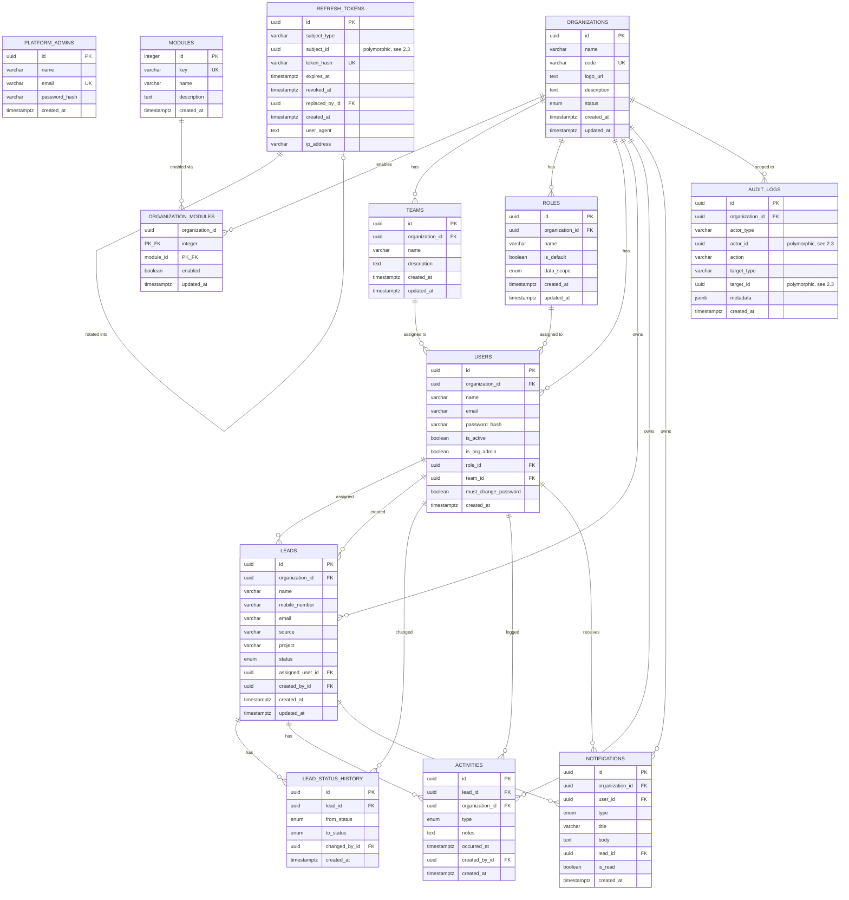
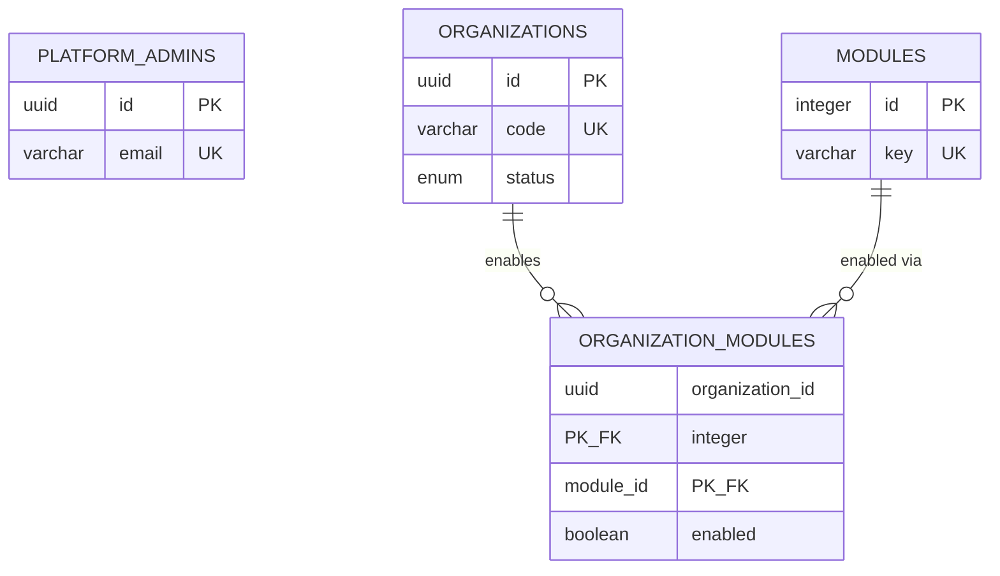
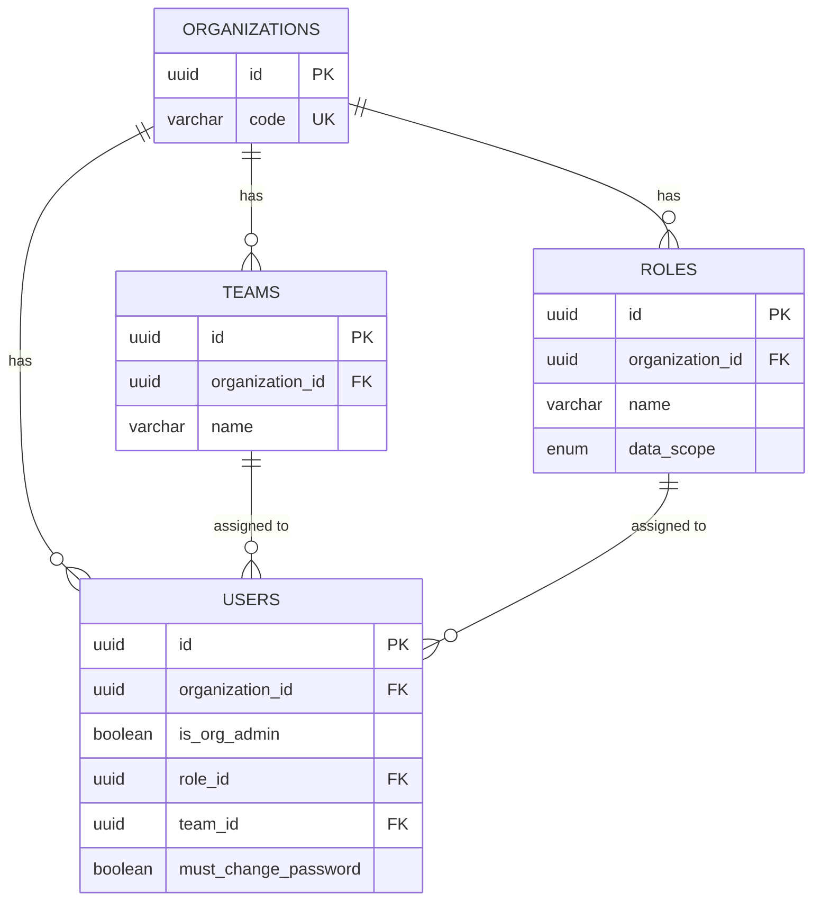
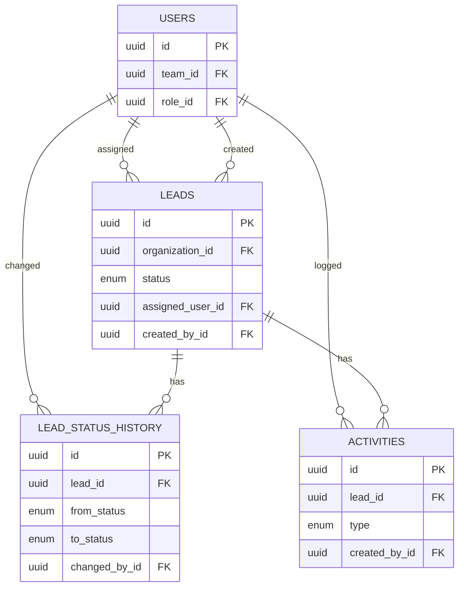

# HiLite Sales OS — Database Design Documentation

PostgreSQL (Neon serverless Postgres). 13 domain tables across 6 migrations,
plus one infrastructure table (`schema_migrations`, used only by the
migration runner — not part of the domain model and not diagrammed below).

Every table and column here was pulled from the actual current schema —
verified against a freshly-migrated database's own `\d+` output, not just
read off the migration `.sql` files — so the constraint names, types, and
defaults below are what's really in the database, not what was intended.

## Contents

1. [Entity-relationship diagrams](#1-entity-relationship-diagrams)
2. [Design principles](#2-design-principles)
3. [Table reference](#3-table-reference)
4. [Index reference](#4-index-reference)
5. [Enum types](#5-enum-types)
6. [Migration history](#6-migration-history)

---

## 1. Entity-relationship diagrams

### 1.1 Complete schema

`PLATFORM_ADMINS` has no relationship lines into the diagram above on
purpose — see §2.3 on why `REFRESH_TOKENS`/`AUDIT_LOGS` can't draw one
either, despite platform admins being a real "subject"/"actor" type for
both.

### 1.2 Platform & tenancy (zoomed in)

The two tables that exist *outside* any tenant, and the join table that
connects the module catalog to each tenant's enablement flags:

### 1.3 Organization administration (zoomed in)

### 1.4 Sales management (zoomed in)

---

## 2. Design principles

### 2.1 Multi-tenancy: shared database, shared schema, `organization_id` discriminator

Every tenant-owned table carries an `organization_id` foreign key to
`organizations`, `ON DELETE CASCADE`. There's no database-per-tenant or
schema-per-tenant split — one set of tables serves every organization,
and isolation is enforced at the **query layer**, not the schema layer:
every service-layer query filters by `organization_id` taken from the
caller's verified JWT, never from anything client-supplied. `API.md` and
the root `README.md` cover the application-level mechanics of this in
depth; what matters here is that this is *why* `organization_id` shows up
directly on 8 of the 13 tables (every tenant-owned table except
`lead_status_history`, which inherits its tenant through `leads.lead_id`
instead of duplicating the column) and is the leading column in nearly
every composite index in §4 — it's the column every real query filters
on first.

`platform_admins`, `modules`, and `organizations` itself are the only
tables with no `organization_id` — they exist *above* the tenant boundary
(platform admins manage organizations; the module catalog is shared
across all of them).

### 2.2 UUID primary keys (with one deliberate exception)

Every table uses `UUID PRIMARY KEY DEFAULT gen_random_uuid()` except
`modules.id`, which is a plain `SERIAL`. That's intentional, not an
oversight: `modules` is a small, slow-growing, platform-controlled
catalog — there's no multi-tenant id-guessing concern (nothing sensitive
hangs off a module id) and no risk of independent processes generating
colliding ids, so a compact sequential integer costs nothing and is
slightly cheaper to index and join on (`organization_modules.module_id`
is an `INT`, not a 16-byte `UUID`). Every other table either belongs to a
tenant or is referenced across tenant boundaries in ways where a
sequential, guessable id would be a real exposure (e.g. `leads.id`,
`organizations.id`) — UUIDs avoid that and avoid needing a centralized
sequence at all, which matters more as the system scales out.

### 2.3 Polymorphic references — real, but not foreign keys

`refresh_tokens.subject_id`, `audit_logs.actor_id`, and
`audit_logs.target_id` are **not** declared as foreign keys, even though
they always reference a real row somewhere. They're polymorphic: a
`subject_type`/`actor_type` column (`'platform_admin'` or `'org_user'`)
or a `target_type` string (`'organization'`, `'user'`, `'role'`, ...)
says *which* table the id belongs to, and the application resolves it
accordingly — there's no single table a DB-level `FOREIGN KEY` constraint
could point at, since the id might belong to `platform_admins` in one row
and `users` in the next.

The trade-off is explicit: this lets one `refresh_tokens` table serve
both platform admins and org users (identical lifecycle logic either way
— see §3) and one `audit_logs` table record actions against any kind of
target, instead of near-duplicate tables per principal/target type. The
cost is that Postgres can't enforce or cascade those particular
references — deleting a `platform_admin` row, for instance, would not
automatically clean up their `refresh_tokens` rows the way deleting an
`organization` cleans up everything that's actually FK'd to it. This is
why those two tables have no relationship lines drawn to `USERS` or
`PLATFORM_ADMINS` in §1.1 — a line there would assert a guarantee the
database doesn't actually provide.

### 2.4 History instead of overwrite

`lead_status_history` exists because the assessment calls for tracking
lead status changes over time, not just the current value. Every status
transition — including the very first `NULL → 'new'` on creation — is an
*insert*, never an update to a "current status" column elsewhere. `leads.status`
itself still holds the current value (so list/filter queries don't need
to aggregate history on every read), but the history table is the
authoritative timeline.

### 2.5 `CASCADE` vs `SET NULL` — whose data is it?

Every foreign key's `ON DELETE` behavior follows one rule: **does this
row belong to the thing being deleted, or does it just reference it?**

- Rows that belong to an organization (`teams`, `roles`, `users`,
  `leads`, `activities`, `notifications`, `organization_modules`, the
  org-scoped rows in `audit_logs`) `CASCADE` — deleting an organization
  genuinely means all of its data goes with it.
- Rows that merely *reference* a person (`leads.assigned_user_id`,
  `leads.created_by_id`, `lead_status_history.changed_by_id`,
  `activities.created_by_id`, `users.team_id`, `users.role_id`) `SET
  NULL` instead. Deleting a user shouldn't delete every lead they ever
  touched — the lead survives, it just shows "unassigned" or a blank
  "created by." Same logic for deleting a team or role: members become
  unassigned rather than being deleted themselves (this is also enforced
  in the application layer — team/role deletion never cascades to users
  — the DB-level `SET NULL` is what makes that safe even if it weren't).
- `lead_status_history` and `activities` cascade from `leads` itself
  (`lead_status_history.lead_id`, `activities.lead_id`) — a lead's
  history and activity log are part of the lead, not independent
  records, so deleting a lead takes them with it. (In practice nothing in
  the application ever deletes a lead — leads only move through
  `status`, including `'lost'` — but the constraint is correct regardless
  of whether the app currently exercises that path.)

There is deliberately no hard-delete path for organizations, users, or
leads anywhere in the application — `organizations.status`,
`users.is_active`, and `leads.status` are how those get "removed" without
losing the row. The cascade/set-null rules above are what happens if a
row *is* deleted directly (e.g. by a future admin tool, or by hand against
the database), not something the current API surface triggers in normal
operation.

---

## 3. Table reference

Grouped by the migration that introduced them. Every column is exactly
as reported by `\d+` against a freshly-migrated database.

### 3.1 `platform_admins` — *introduced in `001_init.sql`*
Super-admins who manage the platform itself. Not tenant users — they sit
above every organization and have no `organization_id`.

| Column | Type | Nullable | Default |
|---|---|---|---|
| `id` | uuid | not null | `gen_random_uuid()` |
| `name` | varchar(150) | not null | — |
| `email` | varchar(150) | not null | — |
| `password_hash` | varchar(255) | not null | — |
| `created_at` | timestamptz | not null | `now()` |

- **PK**: `platform_admins_pkey` (`id`)
- **Unique**: `platform_admins_email_key` (`email`)

### 3.2 `modules` — *introduced in `001_init.sql`*
Master catalog of feature modules. Adding a row here doesn't grant it to
any organization — see `organization_modules` below.

| Column | Type | Nullable | Default |
|---|---|---|---|
| `id` | integer | not null | `nextval('modules_id_seq')` |
| `key` | varchar(50) | not null | — |
| `name` | varchar(100) | not null | — |
| `description` | text | nullable | — |
| `created_at` | timestamptz | not null | `now()` |

- **PK**: `modules_pkey` (`id`)
- **Unique**: `modules_key_key` (`key`)
- **Referenced by**: `organization_modules.module_id`

### 3.3 `organizations` — *introduced in `001_init.sql`*
One row per tenant. The root of the entire multi-tenancy model — every
other tenant-owned table traces back here, directly or transitively.

| Column | Type | Nullable | Default |
|---|---|---|---|
| `id` | uuid | not null | `gen_random_uuid()` |
| `name` | varchar(150) | not null | — |
| `code` | varchar(50) | not null | — |
| `logo_url` | text | nullable | — |
| `description` | text | nullable | — |
| `status` | `organization_status` enum | not null | `'active'` |
| `created_at` | timestamptz | not null | `now()` |
| `updated_at` | timestamptz | not null | `now()` |

- **PK**: `organizations_pkey` (`id`)
- **Unique**: `organizations_code_key` (`code`) — the slug used at org-user login to resolve the tenant
- **Referenced by**: `activities`, `audit_logs` (nullable), `leads`, `notifications`, `organization_modules`, `roles`, `teams`, `users` — all `ON DELETE CASCADE`

### 3.4 `organization_modules` — *introduced in `001_init.sql`*
Join table: which modules are switched on for which org. A
composite-key table with no surrogate `id` of its own — the pair *is*
the identity.

| Column | Type | Nullable | Default |
|---|---|---|---|
| `organization_id` | uuid | not null | — |
| `module_id` | integer | not null | — |
| `enabled` | boolean | not null | `true` |
| `updated_at` | timestamptz | not null | `now()` |

- **PK**: `organization_modules_pkey` (`organization_id`, `module_id`)
- **FK**: `organization_modules_organization_id_fkey` → `organizations(id)` `ON DELETE CASCADE`
- **FK**: `organization_modules_module_id_fkey` → `modules(id)` `ON DELETE CASCADE`

A row missing here (e.g. a module created after this org) is treated as
`enabled = false` by every read — see §2 of `API.md`'s Module 1 section.

### 3.5 `teams` — *introduced in `002_organization_admin.sql`*

| Column | Type | Nullable | Default |
|---|---|---|---|
| `id` | uuid | not null | `gen_random_uuid()` |
| `organization_id` | uuid | not null | — |
| `name` | varchar(150) | not null | — |
| `description` | text | nullable | — |
| `created_at` | timestamptz | not null | `now()` |
| `updated_at` | timestamptz | not null | `now()` |

- **PK**: `teams_pkey` (`id`)
- **Unique**: `teams_organization_id_name_key` (`organization_id`, `name`) — team names are unique per org, not globally
- **FK**: `teams_organization_id_fkey` → `organizations(id)` `ON DELETE CASCADE`
- **Referenced by**: `users.team_id` `ON DELETE SET NULL`

### 3.6 `roles` — *introduced in `002_organization_admin.sql`, extended in `004_sales_management.sql`*
Per-organization, admin-editable — replaced a fixed enum specifically
because Module 2 requires admins to create and manage roles themselves.

| Column | Type | Nullable | Default |
|---|---|---|---|
| `id` | uuid | not null | `gen_random_uuid()` |
| `organization_id` | uuid | not null | — |
| `name` | varchar(100) | not null | — |
| `is_default` | boolean | not null | `false` |
| `created_at` | timestamptz | not null | `now()` |
| `updated_at` | timestamptz | not null | `now()` |
| `data_scope` | `data_scope` enum | not null | `'own'` *(added in 004)* |

- **PK**: `roles_pkey` (`id`)
- **Unique**: `roles_organization_id_name_key` (`organization_id`, `name`)
- **FK**: `roles_organization_id_fkey` → `organizations(id)` `ON DELETE CASCADE`
- **Referenced by**: `users.role_id` `ON DELETE SET NULL`

`data_scope` (`own`/`team`/`organization`) is what Module 3/4 actually
key lead/dashboard visibility off — deliberately decoupled from `name` so
renaming a role (or inventing a new one) never silently changes anyone's
access. `is_default = true` marks the four seeded roles (Executive, Team
Lead, Sales Manager, Director) — the application layer blocks *deleting*
these (not enforced at the DB level) but allows renaming and rescoping
them freely.

### 3.7 `users` — *introduced in `001_init.sql`, substantially altered in `002`, extended in `006`*
Tenant-scoped users — every org user, regardless of admin status or
role, is one row here.

| Column | Type | Nullable | Default |
|---|---|---|---|
| `id` | uuid | not null | `gen_random_uuid()` |
| `organization_id` | uuid | not null | — |
| `name` | varchar(150) | not null | — |
| `email` | varchar(150) | not null | — |
| `password_hash` | varchar(255) | nullable | — |
| `is_active` | boolean | not null | `true` |
| `created_at` | timestamptz | not null | `now()` |
| `is_org_admin` | boolean | not null | `false` *(added in 002)* |
| `role_id` | uuid | nullable | — *(added in 002)* |
| `team_id` | uuid | nullable | — *(added in 002)* |
| `must_change_password` | boolean | not null | `false` *(added in 006)* |

- **PK**: `users_pkey` (`id`)
- **Unique**: `users_organization_id_email_key` (`organization_id`, `email`) — email is only unique *within* a tenant, which is why org login needs an organization code, not just an email
- **FK**: `users_organization_id_fkey` → `organizations(id)` `ON DELETE CASCADE`
- **FK**: `users_role_id_fkey` → `roles(id)` `ON DELETE SET NULL`
- **FK**: `users_team_id_fkey` → `teams(id)` `ON DELETE SET NULL`
- **Referenced by**: `activities.created_by_id`, `lead_status_history.changed_by_id`, `leads.assigned_user_id`, `leads.created_by_id`, `notifications.user_id` (`ON DELETE CASCADE`) — all others `ON DELETE SET NULL`

`001_init.sql` originally gave this table a fixed `role` enum
(`org_admin`/`director`/`team_lead`/`sales_manager`/`executive`). `002`
drops that column and the enum type entirely, replacing "org admin" with
the `is_org_admin` privilege flag (it's a permission, not a position in
the sales hierarchy) and "role" with the FK to the new editable `roles`
table — backfilling every pre-existing user's `is_org_admin` from the old
enum value before dropping it, so no data was lost in the swap.

### 3.8 `refresh_tokens` — *introduced in `003_security_hardening.sql`*
One table, both principal types — see §2.3 for why `subject_id` isn't a
foreign key.

| Column | Type | Nullable | Default |
|---|---|---|---|
| `id` | uuid | not null | `gen_random_uuid()` |
| `subject_type` | varchar(20) | not null | — |
| `subject_id` | uuid | not null | — |
| `token_hash` | varchar(64) | not null | — |
| `expires_at` | timestamptz | not null | — |
| `revoked_at` | timestamptz | nullable | — |
| `replaced_by_id` | uuid | nullable | — |
| `created_at` | timestamptz | not null | `now()` |
| `user_agent` | text | nullable | — |
| `ip_address` | varchar(45) | nullable | — |

- **PK**: `refresh_tokens_pkey` (`id`)
- **Unique**: `refresh_tokens_token_hash_key` (`token_hash`) — the raw token is never stored, only its sha256 hash
- **Check**: `refresh_tokens_subject_type_check` — `subject_type IN ('platform_admin', 'org_user')`
- **FK**: `refresh_tokens_replaced_by_id_fkey` → `refresh_tokens(id)` `ON DELETE SET NULL` (self-referencing — each rotation links to what replaced it)

### 3.9 `audit_logs` — *introduced in `003_security_hardening.sql`*

| Column | Type | Nullable | Default |
|---|---|---|---|
| `id` | uuid | not null | `gen_random_uuid()` |
| `organization_id` | uuid | nullable | — |
| `actor_type` | varchar(20) | not null | — |
| `actor_id` | uuid | not null | — |
| `action` | varchar(100) | not null | — |
| `target_type` | varchar(50) | nullable | — |
| `target_id` | uuid | nullable | — |
| `metadata` | jsonb | nullable | — |
| `created_at` | timestamptz | not null | `now()` |

- **PK**: `audit_logs_pkey` (`id`)
- **Check**: `audit_logs_actor_type_check` — `actor_type IN ('platform_admin', 'org_user')`
- **FK**: `audit_logs_organization_id_fkey` → `organizations(id)` `ON DELETE CASCADE` — **nullable**, since platform-level actions (e.g. a platform admin creating an org) have no organization to scope to yet

### 3.10 `leads` — *introduced in `004_sales_management.sql`*

| Column | Type | Nullable | Default |
|---|---|---|---|
| `id` | uuid | not null | `gen_random_uuid()` |
| `organization_id` | uuid | not null | — |
| `name` | varchar(150) | not null | — |
| `mobile_number` | varchar(20) | not null | — |
| `email` | varchar(150) | nullable | — |
| `source` | varchar(100) | nullable | — |
| `project` | varchar(150) | nullable | — |
| `status` | `lead_status` enum | not null | `'new'` |
| `assigned_user_id` | uuid | nullable | — |
| `created_by_id` | uuid | nullable | — |
| `created_at` | timestamptz | not null | `now()` |
| `updated_at` | timestamptz | not null | `now()` |

- **PK**: `leads_pkey` (`id`)
- **FK**: `leads_organization_id_fkey` → `organizations(id)` `ON DELETE CASCADE`
- **FK**: `leads_assigned_user_id_fkey` → `users(id)` `ON DELETE SET NULL`
- **FK**: `leads_created_by_id_fkey` → `users(id)` `ON DELETE SET NULL`
- **Referenced by**: `activities.lead_id`, `lead_status_history.lead_id` (`ON DELETE CASCADE`); `notifications.lead_id` (`ON DELETE SET NULL`)

### 3.11 `lead_status_history` — *introduced in `004_sales_management.sql`*
Append-only — see §2.4.

| Column | Type | Nullable | Default |
|---|---|---|---|
| `id` | uuid | not null | `gen_random_uuid()` |
| `lead_id` | uuid | not null | — |
| `from_status` | `lead_status` enum | nullable | — *(null on the initial row)* |
| `to_status` | `lead_status` enum | not null | — |
| `changed_by_id` | uuid | nullable | — |
| `created_at` | timestamptz | not null | `now()` |

- **PK**: `lead_status_history_pkey` (`id`)
- **FK**: `lead_status_history_lead_id_fkey` → `leads(id)` `ON DELETE CASCADE`
- **FK**: `lead_status_history_changed_by_id_fkey` → `users(id)` `ON DELETE SET NULL`

### 3.12 `activities` — *introduced in `004_sales_management.sql`*

| Column | Type | Nullable | Default |
|---|---|---|---|
| `id` | uuid | not null | `gen_random_uuid()` |
| `lead_id` | uuid | not null | — |
| `organization_id` | uuid | not null | — |
| `type` | `activity_type` enum | not null | — |
| `notes` | text | nullable | — |
| `occurred_at` | timestamptz | not null | `now()` |
| `created_by_id` | uuid | nullable | — |
| `created_at` | timestamptz | not null | `now()` |

- **PK**: `activities_pkey` (`id`)
- **FK**: `activities_lead_id_fkey` → `leads(id)` `ON DELETE CASCADE`
- **FK**: `activities_organization_id_fkey` → `organizations(id)` `ON DELETE CASCADE`
- **FK**: `activities_created_by_id_fkey` → `users(id)` `ON DELETE SET NULL`

Carries its own `organization_id` rather than relying on a join through
`leads` for it — every list/count query in Module 3/4 filters activities
by org directly, and duplicating that one column is cheaper than forcing
a join onto every single one of those queries.

### 3.13 `notifications` — *introduced in `005_notifications.sql`*
Written only by Module 5's event-bus subscribers reacting to Module 3's
domain events — never by Module 3 directly. See `API.md` §7.

| Column | Type | Nullable | Default |
|---|---|---|---|
| `id` | uuid | not null | `gen_random_uuid()` |
| `organization_id` | uuid | not null | — |
| `user_id` | uuid | not null | — |
| `type` | `notification_type` enum | not null | — |
| `title` | varchar(200) | not null | — |
| `body` | text | nullable | — |
| `lead_id` | uuid | nullable | — |
| `is_read` | boolean | not null | `false` |
| `created_at` | timestamptz | not null | `now()` |

- **PK**: `notifications_pkey` (`id`)
- **FK**: `notifications_organization_id_fkey` → `organizations(id)` `ON DELETE CASCADE`
- **FK**: `notifications_user_id_fkey` → `users(id)` `ON DELETE CASCADE` — unlike most person-references, this one *does* cascade: a notification with no recipient left isn't meaningful data, it's just orphaned
- **FK**: `notifications_lead_id_fkey` → `leads(id)` `ON DELETE SET NULL`

### 3.14 `must_change_password` column — *added to `users` in `006_must_change_password.sql`*
Not a new table — see row in §3.7. Listed separately in the migration
history (§6) because it's its own migration file, addressing a gap
discovered after Module 2 shipped: every system-generated temp password
worked indefinitely until someone voluntarily changed it.

---

## 4. Index reference

Every index in the schema, consolidated. The pattern throughout: composite
indexes are built to match an actual `WHERE` clause the service layer
issues, not just "index every foreign key" — see the rationale comment
inline in `004_sales_management.sql` for the clearest example of this.

| Table | Index | Columns | Why |
|---|---|---|---|
| `users` | `idx_users_organization_id` | `(organization_id)` | Every tenant-scoped user query |
| `users` | `idx_users_role_id` | `(role_id)` | Role-deletion in-use check |
| `users` | `idx_users_team_id` | `(team_id)` | Team-deletion member lookup |
| `organization_modules` | `idx_organization_modules_org_id` | `(organization_id)` | Per-org module list |
| `teams` | `idx_teams_organization_id` | `(organization_id)` | Team list per org |
| `roles` | `idx_roles_organization_id` | `(organization_id)` | Role list per org |
| `refresh_tokens` | `idx_refresh_tokens_subject` | `(subject_type, subject_id)` | "This subject's tokens" on every refresh/revoke |
| `refresh_tokens` | `idx_refresh_tokens_expires_at` | `(expires_at)` | Supports a future cleanup job purging dead rows — no such job exists yet |
| `audit_logs` | `idx_audit_logs_organization_id` | `(organization_id)` | Per-org audit trail |
| `audit_logs` | `idx_audit_logs_created_at` | `(created_at DESC)` | Newest-first across the whole table |
| `leads` | `idx_leads_org_assigned` | `(organization_id, assigned_user_id)` | `own`-scope lead queries — "my leads" |
| `leads` | `idx_leads_org_status` | `(organization_id, status)` | Pipeline/status filter views |
| `leads` | `idx_leads_org_created_at` | `(organization_id, created_at DESC)` | Default list ordering |
| `lead_status_history` | `idx_lead_status_history_lead_id` | `(lead_id, created_at DESC)` | One lead's timeline, newest first |
| `activities` | `idx_activities_lead_id` | `(lead_id, occurred_at DESC)` | One lead's activity log |
| `activities` | `idx_activities_org_id` | `(organization_id)` | Org-wide activity counts (Module 4) |
| `notifications` | `idx_notifications_user_unread` | `(user_id, is_read, created_at DESC)` | Both real query shapes this table ever serves — "my notifications" and "my unread count" — match this one index directly |

Every `UNIQUE` constraint (listed per-table in §3) also functions as an
index — Postgres doesn't need a separate one for those.

`team_scope` lead queries (visible to Team Leads/Sales Managers) join
`leads` to `users` on `assigned_user_id` and filter on `users.team_id` —
that's `idx_leads_org_assigned` plus `idx_users_team_id` working together,
not a dedicated composite index of its own.

---

## 5. Enum types

Fixed vocabularies use a Postgres `ENUM` type; vocabularies an org admin
needs to edit (roles, teams, the module catalog) are tables instead — see
§2 of `API.md` for why that distinction matters for `roles` specifically.

| Type | Values | Used by |
|---|---|---|
| `organization_status` | `active`, `suspended` | `organizations.status` |
| `data_scope` | `own`, `team`, `organization` | `roles.data_scope` |
| `lead_status` | `new`, `contacted`, `visit_scheduled`, `site_visit_completed`, `negotiation`, `won`, `lost` | `leads.status`, `lead_status_history.from_status`/`to_status` |
| `activity_type` | `phone_call`, `meeting`, `site_visit`, `virtual_meeting` | `activities.type` |
| `notification_type` | `lead_assigned`, `lead_won` | `notifications.type` |

A sixth enum, `user_role`
(`org_admin`/`director`/`team_lead`/`sales_manager`/`executive`), existed
from `001_init.sql` and was dropped in `002_organization_admin.sql` once
`roles` replaced it — it no longer exists in the schema (see §3.7).

---

## 6. Migration history

| File | Adds / changes |
|---|---|
| `001_init.sql` | `platform_admins`, `modules`, `organizations`, `organization_modules`, `users` (with the since-removed `role` enum) |
| `002_organization_admin.sql` | `teams`, `roles` (+ backfills 4 default roles for pre-existing orgs); `users` gains `is_org_admin`/`role_id`/`team_id`, loses `role` |
| `003_security_hardening.sql` | `refresh_tokens`, `audit_logs` |
| `004_sales_management.sql` | `leads`, `lead_status_history`, `activities`; `roles` gains `data_scope` (+ backfills scopes for the 4 defaults by name) |
| `005_notifications.sql` | `notifications` |
| `006_must_change_password.sql` | `users` gains `must_change_password` |

Each migration is idempotent (`CREATE TABLE IF NOT EXISTS`, `ADD COLUMN IF
NOT EXISTS`, enum creation wrapped in a `DO $$ ... EXCEPTION WHEN
duplicate_object$$` guard) and tracked in `schema_migrations` by the
runner (`backend/scripts/migrate.js`), so re-running `npm run migrate`
against a database that already has some or all of these applied is
always safe — it only runs what's missing. This was verified directly,
not just assumed from the `IF NOT EXISTS` guards: a database seeded under
the original Module-1-only schema had `002`–`006` applied against it
afterward, and the backfills (default roles, `is_org_admin`, `data_scope`)
ran correctly against that pre-existing data.
